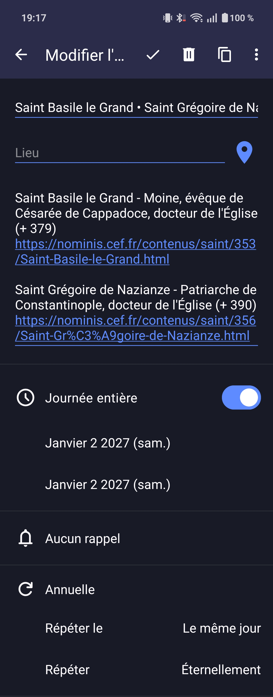

# Calendrier des saints Nominis récurrent

[](LICENSE)

Calendrier ICS récurrent construit à partir du **calendrier des saints et fêtes du jour proposé par [Nominis](https://nominis.cef.fr/)**.

Ce projet transforme le calendrier annuel de Nominis en un calendrier plus adapté à une utilisation permanente : les fêtes à date fixe deviennent récurrentes et les différentes célébrations d'une même journée sont regroupées dans un seul événement.

Le fichier généré utilise le format iCalendar et peut être importé localement ou utilisé dans un environnement CalDAV.

## Pourquoi convertir le calendrier des saints Nominis ?

Les calendriers ICS proposés par Nominis sont générés année par année.

Chaque fête est donc enregistrée comme un événement indépendant. Une fête présente le 2 janvier 2026, par exemple, n'est pas définie comme une occurrence annuelle qui se répétera automatiquement en 2027, 2028, etc.

Le projet transforme les fêtes à date fixe en véritables événements récurrents :

```text
RRULE:FREQ=YEARLY
```

Lorsque plusieurs saints ou célébrations sont présents le même jour, ils sont regroupés dans un seul événement afin de rendre le calendrier plus lisible.

Par exemple :

```text
Saint Basile le Grand • Saint Grégoire de Nazianze
```

Les informations complémentaires et les liens vers les fiches Nominis restent disponibles dans la description de l'événement.

## Fichier prêt à l'emploi

Le fichier `nominis_recurrent_regroupe.ics` contient le calendrier déjà converti et peut être importé directement dans une application compatible iCalendar ou dans un serveur CalDAV.

Il a notamment été testé avec :

- [Radicale](https://radicale.org/) ([GitHub](https://github.com/Kozea/Radicale))
- [DAVx⁵](https://www.davx5.com/) ([GitHub](https://github.com/bitfireAT/davx5-ose))
- [Fossify Calendar](https://www.fossify.org/) ([GitHub](https://github.com/FossifyOrg/Calendar))

Par exemple, le calendrier peut être hébergé dans Radicale, synchronisé sur Android avec DAVx⁵, puis affiché dans Fossify Calendar.

Plus simplement, le fichier ICS peut aussi être importé localement dans une application prenant en charge le format iCalendar, comme Fossify Calendar, Microsoft Outlook, Mozilla Thunderbird ou Apple Calendar.

## Aperçu

<table>
  <tr>
    <td align="center"><strong>Vue agenda</strong></td>
    <td align="center"><strong>Détail d'un événement</strong></td>
  </tr>
  <tr>
    <td>
      
    </td>
    <td>
      
    </td>
  </tr>
</table>

## Utilisation du script

### Prérequis

[Python 3](https://www.python.org/) ([GitHub](https://github.com/python/cpython)) est nécessaire.

Téléchargez d'abord le calendrier annuel des saints au format ICS depuis Nominis :

[Nominis — Téléchargement des calendriers](https://nominis.cef.fr/contenus/telechargement.html)

Placez ensuite le fichier téléchargé dans le même dossier que :

```text
convertir_nominis.py
```

Puis exécutez :

```bash
python convertir_nominis.py nominis2026.ics
```

Sous Windows, la commande peut également être :

```powershell
py convertir_nominis.py nominis2026.ics
```

Le script génère par défaut :

```text
nominis_recurrent_regroupe.ics
```

## Fonctionnement

Le script :

- regroupe les différentes fêtes présentes le même jour ;
- conserve les noms des saints et célébrations dans le titre ;
- conserve les informations détaillées et les liens Nominis dans la description ;
- transforme les événements à date fixe en récurrences annuelles ;
- génère un UID stable pour chaque journée ;
- exclut les événements explicitement liés à une année ;
- exclut certaines célébrations liturgiques mobiles afin de ne pas les transformer à tort en événements à date fixe ;
- vérifie les événements, les UID et les récurrences avant de produire le fichier final.

## Exemple

Dans le calendrier Nominis d'origine, deux événements distincts peuvent être présents le même jour :

```text
Saint Basile le Grand - Moine, évêque de Césarée de Cappadoce, docteur de l'Église (+ 379)

Saint Grégoire de Nazianze - Patriarche de Constantinople, docteur de l'Église (+ 390)
```

Après conversion, ils sont regroupés dans un seul événement :

```text
Saint Basile le Grand • Saint Grégoire de Nazianze
```

Les intitulés complets ainsi que les liens vers les fiches Nominis restent accessibles dans la description de l'événement.

## Limitations

- Les célébrations dont la date varie selon les années, notamment certaines fêtes liées à Pâques, ne peuvent pas être converties en simple récurrence annuelle à date fixe.
- Le script tente de détecter ces célébrations mobiles et de les exclure automatiquement. Cette détection reste volontairement prudente et peut nécessiter une adaptation si la structure ou les intitulés utilisés par Nominis évoluent.
- Un calendrier provenant d'une année non bissextile ne contient pas le 29 février. Les fêtes éventuellement associées à cette date ne peuvent donc pas être générées à partir d'un tel fichier source.

## Source des données

Les données calendaires utilisées comme source proviennent de :

**[Nominis — Conférence des évêques de France](https://nominis.cef.fr/)**

Ce projet est indépendant et n'est ni affilié à Nominis ni officiellement soutenu par Nominis ou la Conférence des évêques de France.

Les liens vers les fiches Nominis d'origine sont conservés dans le calendrier généré.

## Licence

Le script et le code propres à ce projet sont distribués sous [licence MIT](LICENSE).

Cette licence ne prétend pas modifier les droits applicables aux données provenant de Nominis.
